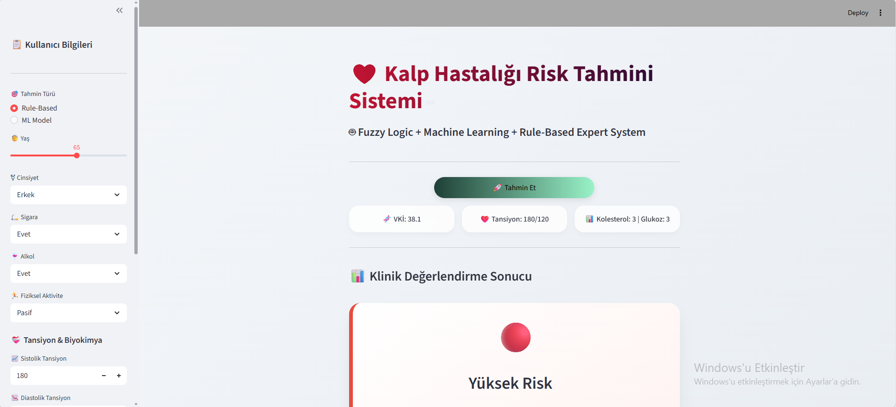
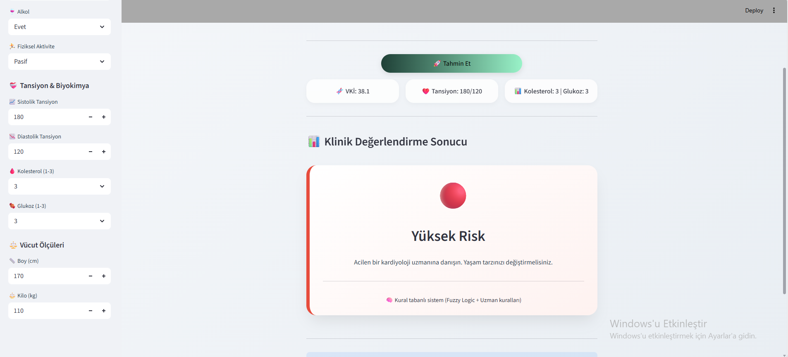
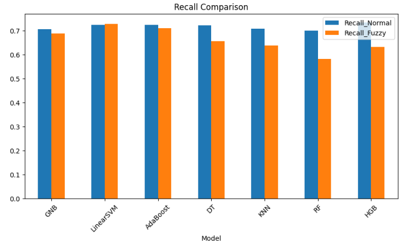
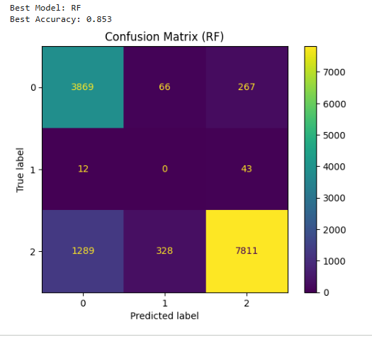

# ❤️ Bulanık Üç Değerli Mantık ile Hibrit Kalp Hastalığı Risk Tahmin Sistemi

## 📌 Proje Hakkında

Bu projede, kalp hastalığı risk tahmini için  
Fuzzy Three-Valued Logic (Bulanık Üç Değerli Mantık)
ve Machine Learning teknolojileri birleştirilerek
hibrit bir yapay zeka sistemi geliştirilmiştir.

Sistem içerisinde:

- 🧠 Fuzzy Logic
- 🤖 Machine Learning
- 📋 Rule-Based Expert System
- 🗄️ SQLite Database
- 🌐 Streamlit Dashboard

birlikte kullanılmaktadır.

Projenin temel amacı,
klasik binary sınıflandırma sistemlerinin
belirsizlik yönetimindeki eksikliklerini azaltarak
daha doğru ve gerçekçi risk tahmini yapmaktır.

---

# 📊 Kullanılan Veri Seti

Bu projede Kaggle platformundan alınan:

## ❤️ Cardiovascular Disease Dataset

veri seti kullanılmıştır.

🔗 Dataset Linki:

https://www.kaggle.com/datasets/sulianova/cardiovascular-disease-dataset

---

## 📁 Veri Seti Özellikleri

| Özellik | Bilgi |
|---|---|
| Toplam Veri Sayısı | 70.000 |
| Özellik Sayısı | 12 |
| Veri Türü | Sağlık / Tıbbi Veri |
| Hedef | Kalp Hastalığı Tahmini |

---

## 📌 Veri Setinde Bulunan Bazı Özellikler

- Yaş
- Cinsiyet
- Boy
- Kilo
- Tansiyon
- Kolesterol
- Glukoz
- Sigara Kullanımı
- Alkol Kullanımı
- Fiziksel Aktivite

Veri seti hem sayısal hem de binary değişkenler içermektedir.

---

# ⚙️ Kullanılan Teknolojiler

- Python
- Pandas
- NumPy
- Matplotlib
- Scikit-Learn
- Streamlit
- SQLite
- Joblib
- Imbalanced-Learn (SMOTE)

---

# 🧠 Fuzzy Logic Sistemi

Projede aşağıdaki üç binary değişken kullanılmıştır:

- Sigara
- Alkol
- Fiziksel Aktivite

Bu değişkenler birleştirilerek:

## Other Factors

adlı yeni bir bulanık değişken oluşturulmuştur.

Bu sütun:

| Değer | Anlam |
|---|---|
| 0 | Sağlıklı |
| 0.5 | Belirsiz |
| 1 | Riskli |

şeklinde çalışmaktadır.

---

# 📋 Rule-Based Sistem

Projede ayrıca makaledeki Tablo 13’e göre
12 farklı uzman kuralı uygulanmıştır.

Sistem kullanıcıyı:

- Düşük Risk
- Risk Olabilir
- Yüksek Risk

şeklinde sınıflandırmaktadır.

---

# 🤖 Kullanılan Makine Öğrenmesi Modelleri

Projede aşağıdaki 7 algoritma kullanılmıştır:

| Model |
|---|
| Gaussian Naive Bayes (GNB) |
| Linear SVM |
| AdaBoost |
| Decision Tree |
| KNN |
| Random Forest (RF) |
| HistGradientBoosting (HGB) |

---

# 📈 Model Karşılaştırma Sonuçları

## 📊 Accuracy / Precision / Recall / F1 / Specificity Karşılaştırması

| Model | Acc_Fuzzy | Prec_Fuzzy | Recall_Fuzzy | F1_Fuzzy | Spec_Fuzzy |
|---|---|---|---|---|---|
| GNB | 0.549 | 0.535 | 0.690 | 0.450 | 0.810 |
| LinearSVM | 0.609 | 0.590 | 0.730 | 0.498 | 0.855 |
| AdaBoost | 0.718 | 0.592 | 0.711 | 0.543 | 0.892 |
| DT | 0.755 | 0.583 | 0.656 | 0.552 | 0.900 |
| KNN | 0.809 | 0.574 | 0.638 | 0.565 | 0.913 |
| RF | 0.853 | 0.570 | 0.583 | 0.572 | 0.920 |
| HGB | 0.838 | 0.583 | 0.633 | 0.580 | 0.928 |

---

# 🏆 En Başarılı Modeller

| Model | Başarı |
|---|---|
| RF | %85 Accuracy |
| HGB | %83 Accuracy |

Fuzzy Three-Valued Logic kullanımı sayesinde
özellikle RF ve HGB modellerinde
başarı artışı gözlemlenmiştir.

---

# 🖥️ Streamlit Dashboard

Sistem kullanıcıdan:

- Yaş
- Cinsiyet
- Sigara
- Alkol
- Fiziksel Aktivite
- Tansiyon
- Kolesterol
- Glukoz
- Boy / Kilo

bilgilerini alarak gerçek zamanlı risk tahmini yapmaktadır.

---

# 🖼️ Proje Görselleri

## 📌 Ana Dashboard



---

## 📌 ML Model Dashboard



---

## 📌 Accuracy Comparison


---

## 📌 Recall Comparison



---

## 📌 Feature Importance


---

## 📌 Confusion Matrix



---

# 🗄️ SQLite Veritabanı

Projede SQLite kullanılmıştır.

Kaydedilen tablolar:

- raw_data
- processed_data
- fuzzy_data
- results

---

# 🚀 Projeyi Çalıştırma

## Gerekli Kütüphaneler

```bash
pip install -r requirements.txt
```

---

## Streamlit Başlatma

```bash
streamlit run app.py
```

---

# 👨‍🎓 Öğrenci Bilgileri

### Proje Grubu
| Bilgi | Değer |
|---|---|
| Öğrenci Adı | Amir ELAHMED |
| Öğrenci Numarası | 2112721307 |
| Öğrenci Adı | ABDUL RAHMAN KHANOUM |
| Öğrenci Numarası | 2212721317 |
| Öğrenci Adı | İbrahim NASIR |
| Öğrenci Numarası | 2212721308 |

---

# ✅ Sonuç

Bu projede Fuzzy Three-Valued Logic kullanılarak
hibrit bir kalp hastalığı risk tahmin sistemi geliştirilmiştir.

Elde edilen sonuçlar,
bulanık mantık yaklaşımının özellikle bazı modellerde
başarıyı artırdığını göstermektedir.

Sistem hem uzman kurallarını
hem de makine öğrenmesi modellerini
bir arada kullanarak daha güçlü bir yapı sunmaktadır.
